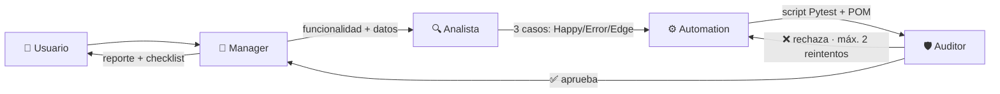

# QA Automation Pipeline — Gestión de Bateadores

Framework de automatización de pruebas **end-to-end** para una SPA de gestión de
jugadores de béisbol, construido con **Python + Pytest + Selenium** sobre el
patrón **Page Object Model (POM)**, y orquestado por un **pipeline multi-agente
de QA** (Manager → Analista → Automation → Auditor).


---

## Qué demuestra este proyecto

- Automatización E2E real contra una aplicación web en vivo (login + CRUD).
- Arquitectura mantenible **Page Object Model** con localizadores como constantes.
- **Esperas explícitas** (`WebDriverWait`) — cero `time.sleep`, cero flakiness
  por waits mezclados.
- **Evidencia automática**: screenshot en cada fallo + **reporte HTML**.
- Suite categorizada con **marcadores** (`smoke`, `regression`, `happy_path`…).
- **CI** con GitHub Actions.
- Estándares de calidad codificados y auditados ([`SKILL.md`](SKILL.md)).

## Pipeline multi-agente de QA

Los prompts viven en [`agents/`](agents/) y se orquestan con Claude Code /
opencode. Cada agente tiene una responsabilidad única:



| Agente | Archivo | Función |
|--------|---------|---------|
| **Manager** | [`agents/manager.md`](agents/manager.md) | Recibe la tarea, pide credenciales/datos, delega, arma el reporte final |
| **Analista** | [`agents/analista.md`](agents/analista.md) | Diseña casos: Happy Path, Error Path, Edge Case |
| **Automation** | [`agents/automation.md`](agents/automation.md) | Escribe el script Pytest + Selenium (POM) |
| **Auditor** | [`agents/auditor.md`](agents/auditor.md) | Audita el código contra `SKILL.md`: aprueba o rechaza |

## Stack

| Herramienta | Uso |
|-------------|-----|
| Python 3.14 | Lenguaje |
| Pytest 8.3 | Test runner, fixtures, marcadores |
| Selenium 4.27 | Automatización del navegador |
| webdriver-manager | Gestión automática del ChromeDriver |
| pytest-html | Reporte HTML autocontenido |
| pytest-xdist | Ejecución en paralelo |
| python-dotenv | Configuración por entorno |

##  Estructura

```
qa-beisbol/
├── agents/                 # Prompts del pipeline multi-agente
│   ├── manager.md
│   ├── analista.md
│   ├── automation.md
│   └── auditor.md
├── pages/                  # Page Object Model
│   ├── login_page.py
│   └── jugador_page.py
├── tests/
│   ├── conftest.py         # fixture driver + screenshot en fallo
│   └── test_crear_jugador.py
├── pytest.ini              # addopts, reporte HTML, marcadores
├── requirements.txt
├── SKILL.md                # Estándares de calidad (regla de oro)
└── .env.example            # Plantilla de configuración
```

##  Puesta en marcha

Requisitos: Python 3.11+ y Google Chrome instalado.

```bash
# 1. Clonar y entrar
git clone <URL-de-tu-repo>.git
cd qa-beisbol

# 2. Entorno virtual
python3 -m venv venv
source venv/bin/activate        # Windows: venv\Scripts\activate

# 3. Dependencias
pip install -r requirements.txt

# 4. Configuración (copia y completa con tus datos)
cp .env.example .env
```

Variables en `.env`:

| Variable | Descripción |
|----------|-------------|
| `APP_URL` | URL base de la app bajo prueba |
| `APP_USER` | Usuario de prueba |
| `APP_PASS` | Contraseña de prueba |
| `HEADLESS` | `true` (por defecto) o `false` para ver el navegador |

##  Ejecución

```bash
# Toda la suite (genera reports/report.html)
pytest

# Ver el navegador
HEADLESS=false pytest

# Por categoría
pytest -m smoke
pytest -m "regression and edge_case"

# En paralelo
pytest -n auto
```

- **Reporte HTML:** `reports/report.html`
- **Screenshots de fallos:** `screenshots/FAIL_<test>_<timestamp>.png`

##  Casos de prueba

| ID | Tipo | Escenario |
|----|------|-----------|
| CP-001 | Happy Path (`smoke`) | Creación exitosa de un bateador |
| CP-002 | Error Path (`regression`) | Botón deshabilitado con campos obligatorios vacíos |
| CP-003 | Edge Case (`regression`) | Nombre con caracteres especiales / límite de longitud |

##  Estándares de calidad

Todo el código se rige por [`SKILL.md`](SKILL.md): selectores robustos (sin
XPath absolutos), solo esperas explícitas (sin `time.sleep` ni waits mezclados),
asserts significativos, POM, evidencia obligatoria y secretos por entorno. El
agente **Auditor** verifica el cumplimiento antes de aprobar cualquier entrega.

## Integración continua

[`.github/workflows/ci.yml`](.github/workflows/ci.yml) instala dependencias y
valida la colección de la suite (`pytest --collect-only`) en cada push/PR. Para
correr los tests E2E completos en CI, define los secretos del repositorio
`APP_URL`, `APP_USER`, `APP_PASS` (Settings → Secrets → Actions) y habilita el
job E2E.

